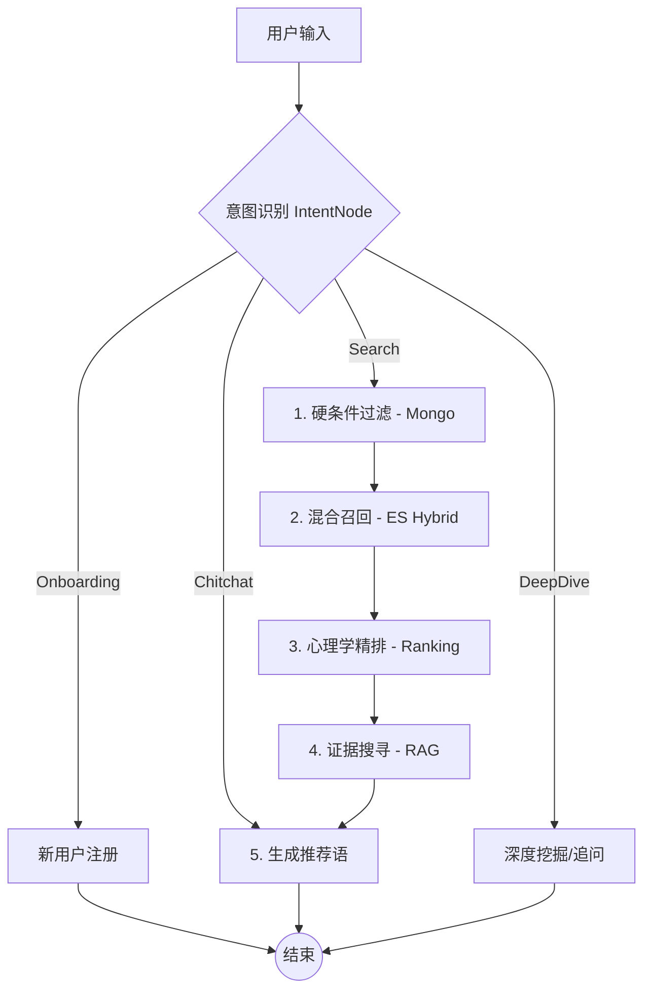

# Digital Matchmaker Agent (拟人化红娘推荐系统)

> 一个基于 LLM、LangGraph 和混合检索（Hybrid Search）构建的智能红娘，旨在提供“有灵魂、有据可依”的婚恋推荐服务。

## 🌟 为什么选择 LLM？(Why LLM)

在传统婚恋系统中，用户画像（Profile）通常依赖于**“填表单”**：用户需要勾选几十个 Checkbox。这种方式导致信息维度受限且体验割裂。

本项目采用了**“从自然语言中生长出结构化画像”**的设计哲学：
*   **Input**: 用户只需像聊天一样说话：“我平时工作比较忙，周末喜欢自己在家做做法式甜品，想找个能陪我一起散步的人。”
*   **LLM Processing**: 系统自动从对话中“读”出性格、价值观、生活习惯，实现**无感建模**。
*   **Output**: 推荐不再受限于预设字段，而是基于细腻的语义理解。

---

## 🏗️ 核心功能深度解析 (Core Features)

### 1. 十大专项画像提取 Agent (Intelligent Profiling)
系统并未完全抛弃结构化数据，而是通过 `app/services/ai/agents` 下的 **10 个专项 Extractor** 协同工作，将非结构化对话转化为精细的结构化存储：

*   **Personality**: 分析大五人格 (Big5) 与 MBTI。
*   **Interest**: 提取标签、评估热情程度。
*   **Values**: 衡量家庭、事业、自由、金钱的权重。
*   **Lifestyle**: 概括作息、运动习惯、烟酒偏好。
*   **LoveStyle**: 分析依恋类型（安全/回避/焦虑）与爱的语言。
*   **Education**: 识别学历、学校档次（985/211/QS100）。
*   **Occupation**: 区分职场/学生身份，提取行业、收入与工作风格。
*   **Family**: 深入挖掘原生家庭氛围、父母状况。
*   **DatingPref**: 锁定择偶硬指标、加分项（Priorities）与雷点（Dealbreakers）。
*   **Risk**: 识别情绪稳定性与潜在社交风险。

这些 Extractor 由 `ProfileManager` 统一调度，随着对话深入不断迭代画像的“丰满度”。

### 2. Onboarding (拟人化交互式访谈)
新用户进入 `OnboardingNode` 后，红娘会启动交互式对话：
*   **高情商引导**：不再是查户口，而是温柔地追问：“哇，那你的工作平时会很忙吗？”
*   **实时画像构建**：对话每进行 3-4 轮，系统自动触发一次批量提取，更新 DB 中的结构化画像。
*   **自动化结算**：一旦核心维度（教育、工作、家庭等）收集完毕，系统通过 `TerminationManager` 自动结束访谈并开启推荐模式。

### 3. 多路召回与应用层 RRF (Hybrid Search)
基于 Elasticsearch 构建 **Hybrid Search** 架构，针对 ES Basic License 不支持 `rank` 参数的限制，在应用层（Application Layer）手动实现了 **RRF (Reciprocal Rank Fusion)** 算法：
*   **Vector Search (KNN)**：利用 `dense_vector` 进行余弦相似度计算，捕获模糊语义与潜在匹配意图。
*   **Full-Text Search (BM25)**：基于文本字段（Tags/Profile）进行关键词检索，确保硬性指标（如“本科学历”、“杭州”）的精准命中。
*   **Manual RRF Fusion**：通过 RRF 公式 $Score = \sum \frac{1}{k + rank}$ 对多路排名进行融合归一化，实现语义召回与关键词检索的完美平衡。

### 4. 证据式推荐 (Evidence-Based RAG)
系统利用 RAG 技术在候选人的历史数据中进行“证据挖掘”。生成的每一句推荐语背后都有真实的聊天细节支撑，解决了推荐系统的“黑盒”问题。

---

## 🔄 LangGraph 架构图



---

## 📚 相关文档 (Documentation)

为了方便深入了解本项目，我们提供了详细的设计与方案文档：

*   **[系统架构设计说明书](./docs/智慧红娘agent系统框架.md)**：深入解析三库协同（Mongo/ES/Chroma）、Hint-Driven Onboarding、双路召回与 RRF 融合等核心技术细节。
*   **[对话样例展示](./docs/对话样例.pdf)**：直观展示红娘 Agent 如何进行温情追问、多轮指代消解以及带有 RAG 证据的深度推荐。
*   **[垂直大模型全链路指南](./docs/MODEL_DISTILLATION_GUIDE.md)**：记录了如何利用 Teacher-Student 蒸馏方案，将 DeepSeek 等通用大模型的逻辑抽取与对话能力“内化”到 7B/8B 级垂直小模型中的全过程。

---

## 🛠️ 技术栈 (Tech Stack)

*   **Core**: Python 3.11, FastAPI, **LangGraph**, LangChain
*   **LLM**: 阿里云百炼 (Qwen/DeepSeek) / OpenAI
*   **Database**: MongoDB, Elasticsearch, ChromaDB
*   **Monitoring**: **LangSmith** (全链路 Tracing 与分析)

---

## 🚀 快速开始 (Quick Start)

### 1. 配置环境
系统变量设置：
```bash
BAILIAN_API_KEY=sk-xxxxxxxx
LANGCHAIN_TRACING_V2=true
LANGCHAIN_API_KEY=lsv2_xxxx
```

### 2. 启动服务
```bash
pip install -r requirements.txt
docker-compose up -d  # 启动外部依赖
uvicorn app.main:app --reload
```

### 3. 数据生成说明 (Data Generation)
> ⚠️ **关于虚拟用户数据**：
> 本项目依赖高质量的虚拟对话数据来支撑 RAG 证据挖掘。早期版本的代码包含完整的数据生成流水线，但在架构重构期间，为了保持核心链路精简，该部分代码暂时移出主仓。
> 
> **后续规划**：我们将重新整合基于 LLM 的“访谈对话 -> 自动画像提取”数据生成链路，确保新用户在零配置下即可获得完整的演示体验。

---

## 📊 监控与监控

通过 **LangSmith**，你可以实时观察每一个 Node 的思考细节，包括：
*   画像提取 Agent 输出了什么样的 JSON。
*   RAG 在哪些对话片段里找到了推荐证据。
*   意图识别是如何对复杂的自然语言进行分类的。

---

## 📝 License
MIT
